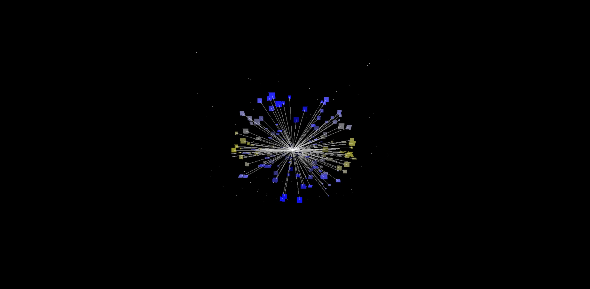
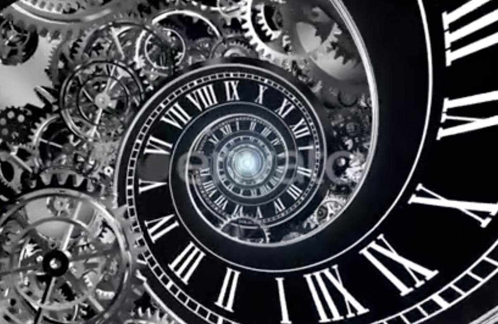

# jhua0458_9103_Final
## How to Interact
The entire piece demonstrates dynamic state transitions controlled by mouse and keyboard input. The detailed interaction methods are outlined below:

- **Use different keyboard keys to change the main element's state：** Pressing any of the Q, W, E, or R keys triggers changes in the main visual element, adding distinct layers and interactivity based on the key pressed.

- **Main visual elements rotate (`mouseX`):** As the `mouseX` changes, the main visual element will rotate.

- **Random stars appear in the center:** By clicking the mouse, twinkling stars will appear randomly in the center circle, increasing the overall fun and uncertainty.

- **Star rotation dynamics (`mouseX`):** When the `mouseX` changes, the vertex star and the center star at the bottom of the hexagonal star will rotate accordingly.

- **Six gradient circle zoom effects (`mouseX`):** When `mouseX` increases, the radius of the gradient circle decreases. Conversely, when `mouseX` decreases, the radius of the gradient circle increases.

- **Dynamic lines radiating outwards (`mouseX`)(`mouseY`):** When the mouse moves horizontally or vertically, the lines radiating outward will rotate and change accordingly, adding dynamic interest to the picture.

## Details of My Individual Approach to Animating the Group Code

### Choice
I chose **User Input** to drive my personal code.

### My code features
My personal code design revolves around the concept of "time passing". The main visual element simulates the rhythm of the clock through regular and smooth rotation, conveying the feeling of time continuing to advance. The outer radial lines, combined with length and angle changes, break the limitations of the two-dimensional plane and enhance the sense of space and visual hierarchy. The irregular rotation rhythm also adds rhythm and interest to the picture. In order to add occasional changes, I set randomly appearing stars in the center to symbolize the uncertain moments in time. All animation effects are linked to the mouse position in real time, making the interaction more natural and smooth. I also added keyboard input to control different main visual states to enhance interactivity. The overall black and white tones are matched with the starry sky background to enhance the tranquility and profound atmosphere of the flow of time.

## Inspiration
My work is inspired by the following two works:

- **Picture 1:** Compared with the monotony brought by the regular rotation of lines in the plane, the dynamic simulation of light scattering can make the rotation of lines show a stronger sense of space and rhythm. By changing the position of the mouse, changing the length and rotation angle of the line, the overall visual effect breaks the plane limitation of two-dimensional rotation.

- **Picture 2:** Compared with the mechanical and monotonous feeling brought by circular elements rotating in a single direction, multiple circular elements rotating in different directions at the same time can visually create a dynamic sense of order and staggered space. It guides the viewer to feel the fluidity and complexity of time while gazing, as if they are in a concrete "time field". In this way, the interface not only becomes a visual carrier, but also symbolizes the experience of the passage of time.

  
**Picture 1:** Line rotation ([Source](https://openprocessing.org/sketch/863365))

  
**Picture 2:** Time Spiral ([Source](https://au.pinterest.com/pin/2111131072429523/))

 ## Technical Explanation

### Use different keyboard keys to change the main element's state.
First, set the main visual rendering (based on the num value). Depending on the value of num, different drawing function combinations in coreElements are triggered to display various graphic elements. Then, through key detection (keyPressed() function), when the user presses the Q, W, E, or R key, the program assigns the variable num to the corresponding number (1 to 4) to switch the current primary visual state.

```
//Different num numbers display different main elements
	if (num == 1) {
		coreElements.drawLine()
		coreElements.diverPoint()
		coreElements.randomPoint()
		coreElements.drawTriangle(90)
		coreElements.drawTriangle(-90)
		coreElements.drawMoon()
		coreElements.lineCircle()
		coreElements.decorationCircle()
	}
	if (num == 2) {
		// coreElements.drawLine()
		coreElements.diverPoint()
		coreElements.randomPoint()
		coreElements.drawTriangle(90)
		coreElements.drawTriangle(-90)
		coreElements.drawMoon()
		coreElements.lineCircle()
		coreElements.decorationCircle()
	}
	if (num == 3) {
		// coreElements.drawLine()
		// coreElements.diverPoint()
		// coreElements.randomPoiewqnt()
		coreElements.drawTriangle(90)
		coreElements.drawTriangle(-90)
		coreElements.drawMoon()
		coreElements.lineCircle()
		coreElements.decorationCircle()
	}
	if (num == 4) {
		// coreElements.drawLine()
		// coreElements.diverPoint()
		// coreElements.randomPoiewqnt()
		// coreElements.drawTriangle(90)
		// coreElements.drawTriangle(-90)
		coreElements.drawMoon()
		// coreElements.lineCircle()
		coreElements.decorationCircle()
	}

function keyPressed() {
	if (key === 'q' || key === 'Q') {
		num = 1;
	} else if (key === 'w' || key === 'W') {
		num = 2;
	} else if (key === 'e' || key === 'E') {
		num = 3;
	} else if (key === 'r' || key === 'R') {
		num = 4;
	}
}
```

### Main visual elements rotate (`mouseX`)
By linking rotate() to the mouse's X position, the overall rotation of all main visual elements is achieved. Dividing mouseX by 10 maps the larger mouse position values to smaller rotation angles (in radians), resulting in a smoother and more fluid rotation animation.

```
//Main visual elements rotate
	rotate(mouseX / 10)
```

### Random stars appear in the center.
This code implements the mouse interaction logic in the p5.js sketch. When the user presses the mouse (mousePressed()), a random value between 0 and 1 is generated. If the value is less than 0.5, the boolean variable haveStar is set to true and the Decryption flag is enabled, which conditionally triggers the rendering of the star.

When the mouse is released (mouseReleased()), both haveStar and Decryption are reset to false, disabling the star effect and restoring the default visual state. This way, a mouse click has a 50% chance of displaying a star.

```
function mousePressed() {
	let randomParameter = random()
	if (randomParameter < 0.5) {
		haveStar = true
	} else {
		haveStar = false
	}
	Decryption = true
}

function mouseReleased() {
	Decryption = false
	haveStar = false
}
```

### Star rotation dynamics (`mouseX`)
By assigning mouseX to the angle parameter in the drawStar(x, y, size, angle) function, the rotation angle of the star will be updated in real time as the mouse moves horizontally on the canvas. At the same time, the input angle of the drawStar() function will also change with the change of mouseX, thus creating a dynamic rotation effect for the star graphic.

```
//Draw a star at the bottom for decoration
	drawStar(0, 0, totalR / 1.9, mouseX)

//Draw the triangle vertex star
    for (let pt of points) {
      drawStar(pt.x, pt.y, starSize / 5, mouseX)
    }
```

### Six gradient circle zoom effects (`mouseX`)
In this code, the radius is set to cos(mouseX / 18) * 70 - i * 10 - j * 10, causing the circles drawn by drawRadialGradientCircle() to dynamically change size based on the mouse's horizontal position (mouseX), thereby achieving a scaling effect.

```
if (d < 0) {
        let innerColor = color(255, 255, 255, 255);
        let outerColor = color(0, 0, 0, 255);

        for (let i = 0; i < 6; i++) {
          drawRadialGradientCircle(sx1, sy1, cos(mouseX / 18) * 70 - i * 10 - j * 10, innerColor, outerColor);
        }
      } else {
        let innerColor1 = color(0, 0, 0, 150);
        let outerColor1 = color(255, 255, 255,);
        for (let i = 0; i < 6; i++) {
          drawRadialGradientCircle(sx1, sy1, cos(mouseX / 18) * 50 - i * 10 - j * 10, innerColor1, outerColor1);
        }
      }
```

### Dynamic lines radiating outwards (`mouseX`)(`mouseY`)
This code uses mouseX and mouseY to control the number of lines and the rotation angle: the outer loop is determined by mouseY / 160, and the inner loop is determined by mouseX / 30; In controlling the angle of the line, - i * mouseX / width * 10 and - i * mouseY / height * 10 dynamically adjust the rotation offset according to the horizontal and vertical positions of the mouse respectively; The horizontal length of the line is controlled by mouseX, and the vertical length is controlled by mouseY. In this way, a radial dynamic effect that changes with the movement of the mouse is achieved.

```
 drawLine() {
    let drawLineDegree = 45
    for (let j = 0; j < mouseY / 160; j++) {
      for (let i = 0; i < mouseX / 30; i++) {
        push()
        strokeWeight(this.size / 200)
        stroke(255, random(120, 180))

        let x1 = cos(drawLineDegree * j - 67.5 - i * mouseX / width * 10) * this.size * mouseX / width * 5 + this.x
        let y1 = sin(drawLineDegree * j - 67.5 - i * mouseY / height * 10) * this.size * mouseY / height * 3 + this.y
        line(this.x, this.y, x1, y1)
        pop()
      }
    }
    push()
    fill(0)
    noStroke()
    circle(this.x, this.y, this.size * 1.15)
    pop()
  }
```